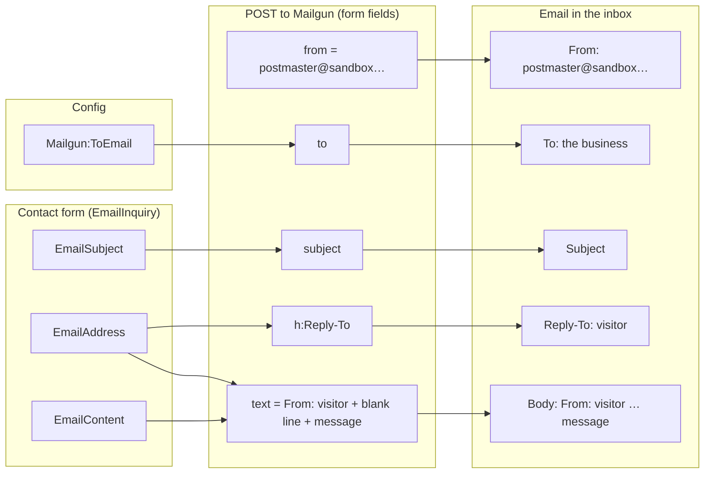
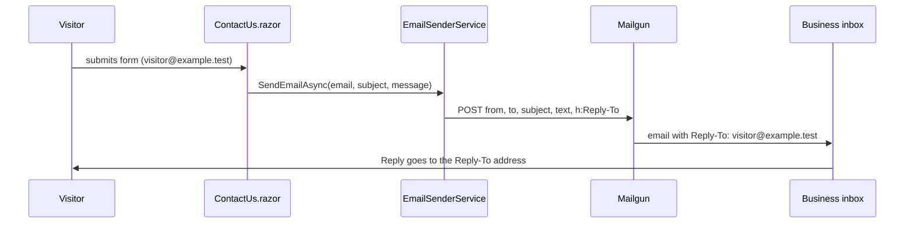
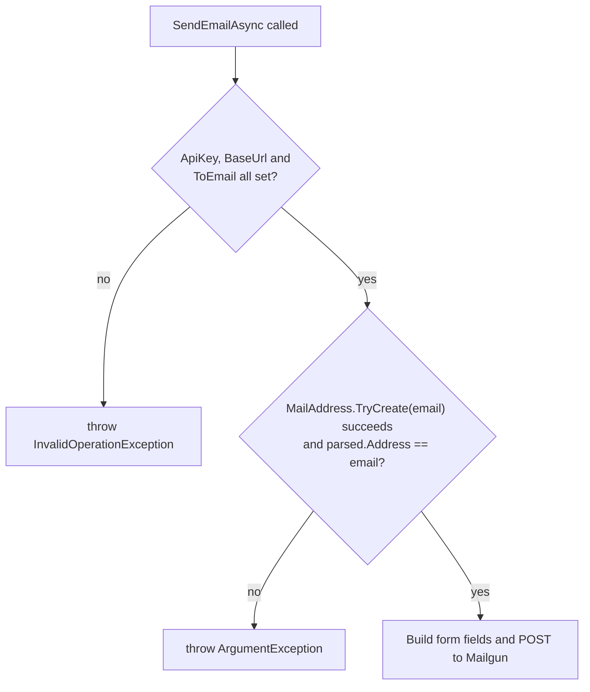

# 1.1 — Reply-To on contact emails

Plan task 1.1. These diagrams show how a contact-form inquiry becomes the email that lands in the
inbox, and why pressing **Reply** now answers the visitor. They render on GitHub and in VS Code's
Markdown preview (Mermaid).

## 1. Form fields → Mailgun fields → the email

`ContactUs.razor` passes the three form fields to `EmailSenderService.SendEmailAsync`. The service
adds the settings from config and POSTs them to Mailgun as form data. Mailgun turns any field that
starts with `h:` into a real email header.

The `from` address stays the sandbox postmaster, because Mailgun only sends from domains it has
verified. Moving it off the sandbox domain is task 1.2. That's why the visitor goes in
**Reply-To** instead of **From**.

## 2. Pressing Reply

**Before task 1.1** there was no Reply-To, so Reply went to `postmaster@sandbox…` and the
visitor never saw the answer.

## 3. Checks before anything is sent

The service stops before building the request if something is wrong, so a bad request never
reaches Mailgun. The contact page catches the exception and shows "Message failed to send."

The second check is **defence in depth**. The form already validates the address, but the service
doesn't rely on that. It rejects:

| Input | Why it's rejected |
|---|---|
| `""`, `not-an-email` | Not valid email syntax |
| `visitor@example.test\r\nBcc: victim@example.test` | Line break: would inject an extra header through Reply-To |
| `Visitor <visitor@example.test>` | Valid syntax, but not a bare address (`parsed.Address` differs from the input) |

## 4. What each new test proves

| Test | Proves |
|---|---|
| `SendEmailAsync_MissingRequiredSetting_ThrowsWithoutSending` (new `ToEmail` row) | Missing `ToEmail` fails fast and sends nothing |
| `SendEmailAsync_ValidConfig_SetsReplyToVisitorEmail` | `h:Reply-To` is the visitor's address |
| `SendEmailAsync_ValidConfig_StartsBodyWithVisitorEmail` | The body starts with `From: <visitor>` |
| `SendEmailAsync_InvalidVisitorEmail_ThrowsWithoutSending` | Bad addresses throw and send nothing |
| `SendEmailAsync_ValidConfig_SendsRecipientSubjectAndMessage` (updated) | The whole body is the `From:` line, a blank line, then the message |
