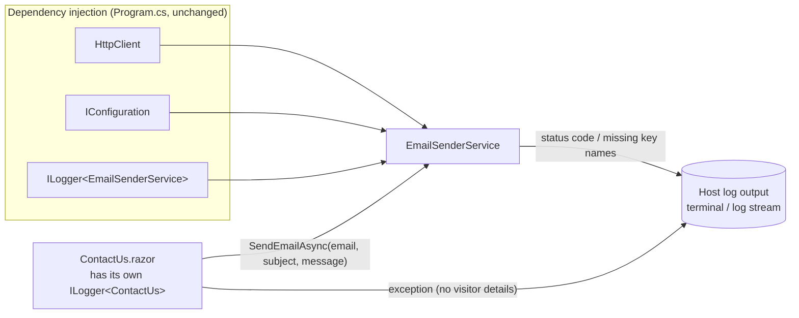
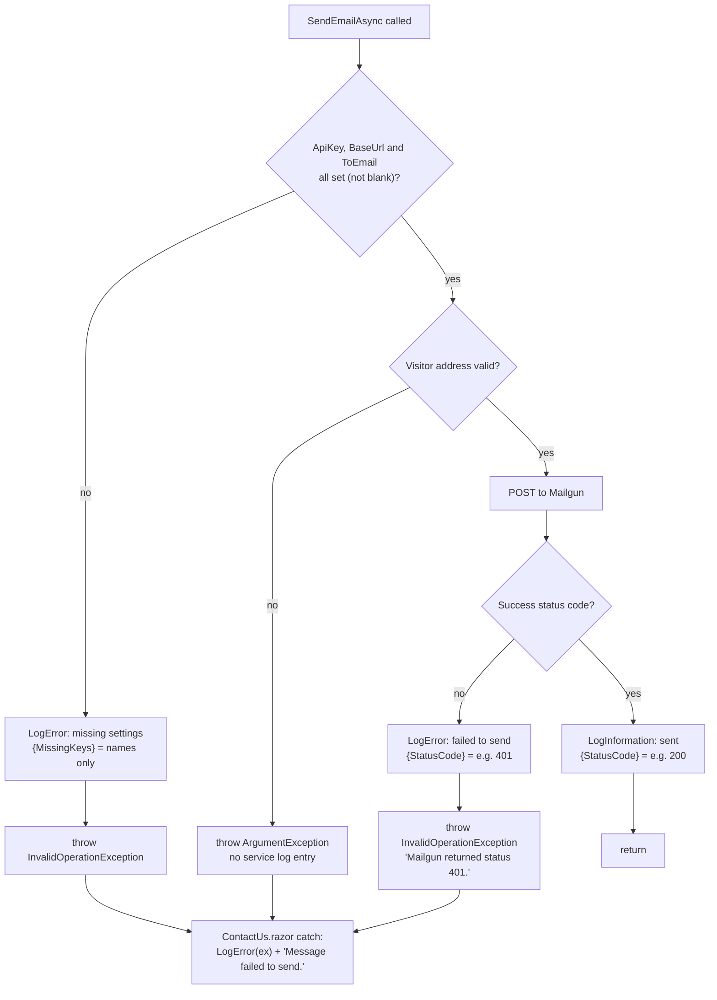
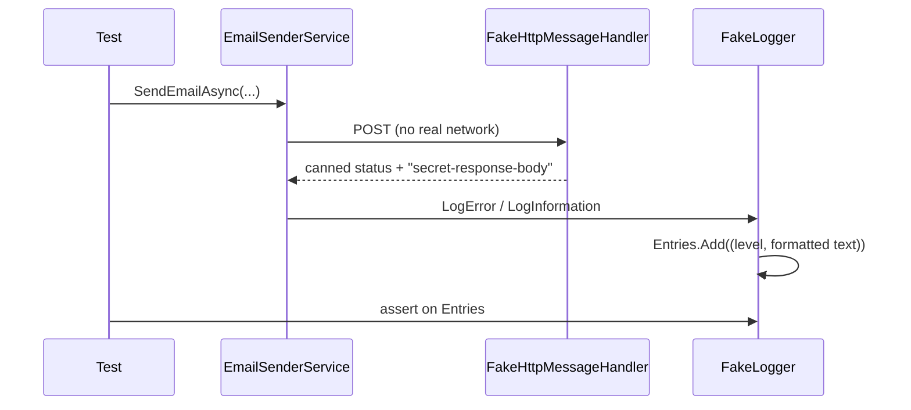

# 1.6 — Logging in the email service

Plan task 1.6. These diagrams show what gets logged when a visitor submits the contact form, and
what is deliberately kept out of the logs. They render on GitHub and in VS Code's Markdown preview
(Mermaid).

## 1. Where log entries come from

`EmailSenderService` now gets an `ILogger<EmailSenderService>` from dependency injection (DI),
alongside its `HttpClient` and `IConfiguration`. ASP.NET Core registers `ILogger<T>` for every type
automatically, so `Program.cs` didn't change. Both loggers write to the same place: whatever
logging the host has configured (the terminal locally, the host's log stream in production).



**Before task 1.6**, the service used `Console.WriteLine` (no log level, easy to lose on a host) and
created a separate `LoggerFactory` that was never used.

## 2. What is logged at each exit of `SendEmailAsync`

`SendEmailAsync` can finish in four ways. Each one either logs exactly one entry, or throws so
`ContactUs.razor` can log it.



| Exit | Level | Logged | Never logged |
|---|---|---|---|
| Missing setting | Error | Names of the missing keys, e.g. `Mailgun:ToEmail` | Any setting's value (the API key) |
| Invalid visitor address | — (only the page logs the exception) | "Visitor email address is invalid." | The address itself |
| Mailgun error | Error | Numeric status code | Response body, visitor details |
| Sent | Information | Numeric status code | Address, subject, message |

On a failure, two entries appear: one from the service (the cause) and one from `ContactUs.razor`
(that the visitor saw an error). That's expected, and neither contains personal details.

## 3. Why the exception message matters

Removing `Console.WriteLine` wasn't enough on its own. The exception used to be
`"Failed to send email: {responseBody}"`, and `ContactUs.razor` logs the exception, so Mailgun's
response body would still reach the logs by a second route:

```mermaid
flowchart LR
    R[Mailgun response body] -. before 1.6 .-> EX[Exception message]
    EX --> PL["ContactUs.razor<br/>Logger.LogError(ex, ...)"]
    PL --> Out[(Logs)]
    SC[Status code only] -- after 1.6 --> EX
```

The service no longer reads the response body at all, so it can't leak by accident.

## 4. Message templates: structured logging

Every call uses a **message template** with a named placeholder, not string interpolation:

```csharp
logger.LogError("Contact email failed to send. Mailgun returned status {StatusCode}.", (int)response.StatusCode);
```

The logger produces two things from that call:

- **Text** for reading: `Contact email failed to send. Mailgun returned status 401.`
- **A named property** `StatusCode = 401` that a structured log viewer can filter and count, for
  example "all failed sends with status 401 this week".

A list value such as `{MissingKeys}` is written as comma-separated text
(`Mailgun:ApiKey, Mailgun:ToEmail`) and still kept as a property.

## 5. How the tests see the logs

Tests can't read the terminal, so they pass in a hand-written `FakeLogger<T>`
(`BlazorApp.RMTWebsite.Tests/Fakes/FakeLogger.cs`) that records each entry's level and final text.
This follows ADR 0002: hand-written fakes, no mocking library.



| Test | Proves |
|---|---|
| `SendEmailAsync_MailgunReturnsError_LogsErrorWithStatusCode` | A failed send logs one Error containing `401` |
| `SendEmailAsync_MailgunReturnsError_DoesNotLogResponseBody` | The response body never reaches the logs (a guard: this one passed before the fix too) |
| `SendEmailAsync_MailgunReturnsError_ExceptionOmitsResponseBody` | The exception message doesn't carry the response body |
| `SendEmailAsync_MailgunValidConfig_LogsInformationWithoutVisitorDetails` | A successful send logs one Information entry with no address, subject or message |
| `SendEmailAsync_MailgunMissingRequiredSetting_LogsError` (3 rows) | Each missing key is named in one Error, and the API key value isn't logged |
