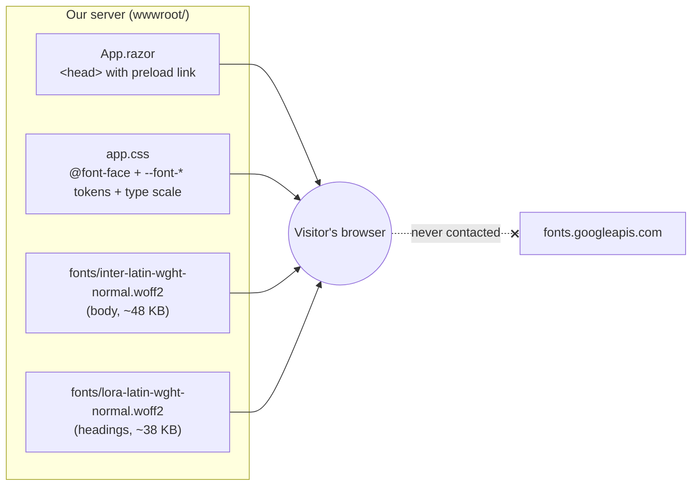
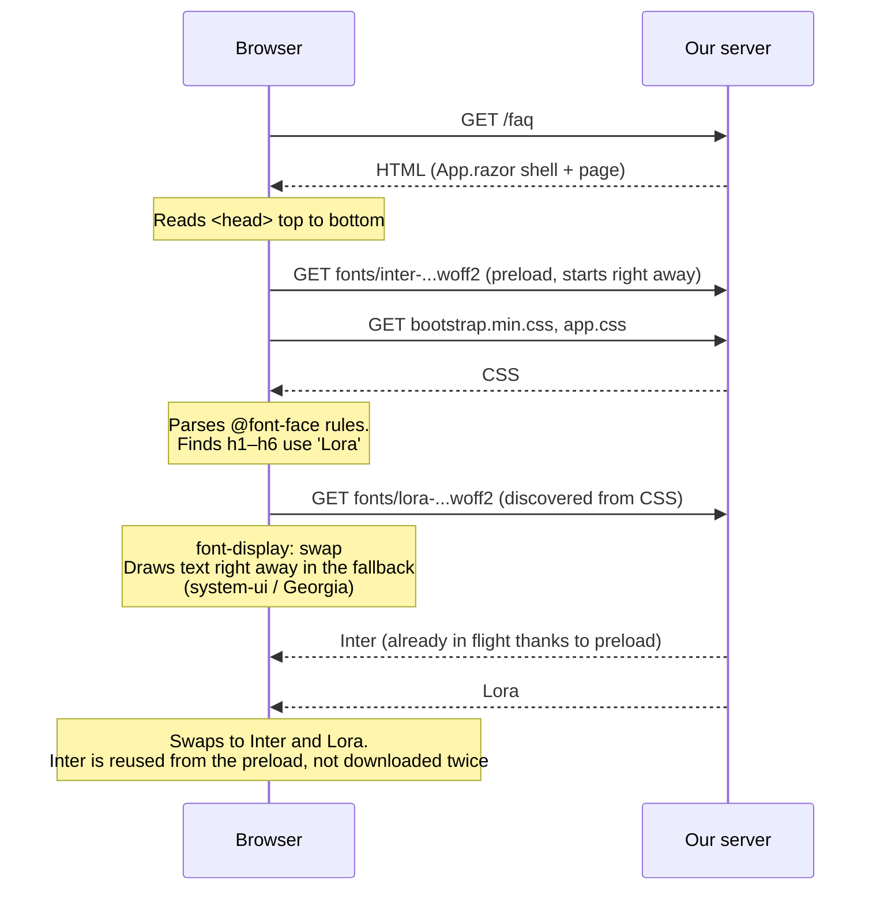
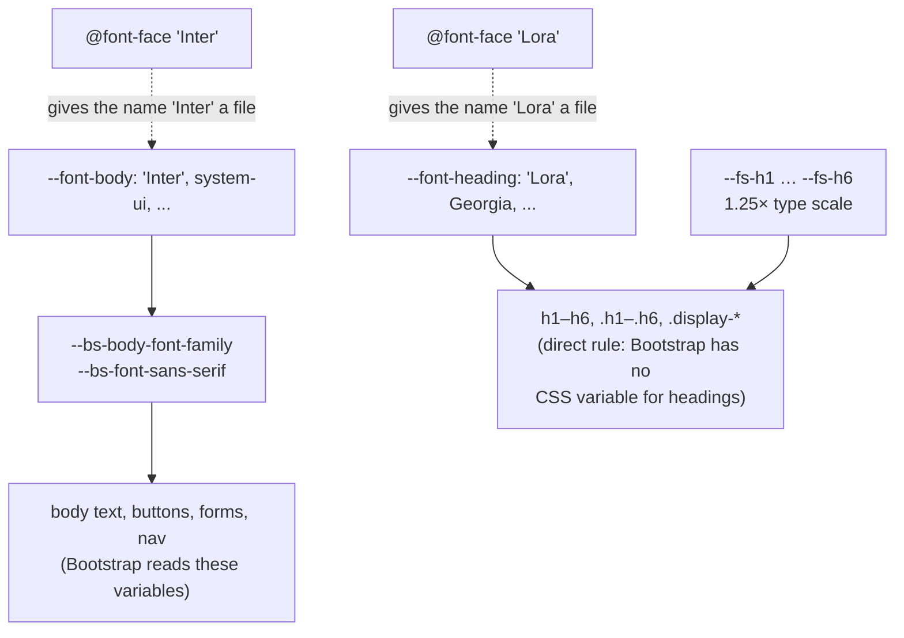

# 2.1 — How the brand fonts load

Plan task 2.1, ADR 0003. These diagrams show how a visitor's browser finds, downloads, and applies
the self-hosted Lora (headings) and Inter (body) fonts. They render on GitHub and in VS Code's
Markdown preview (Mermaid).

## 1. Where everything lives

All font files are served by our own site. Nothing is requested from Google or any other third party.

## 2. The order things happen in

A browser normally finds a font late. It has to download the HTML, then download and parse the CSS,
then find an element that uses the font, and only then request the font file. The preload for
Inter skips the middle steps for the font used on every line of text.

**Why `crossorigin` is on the preload:** browsers always fetch fonts in "CORS mode", even from the
same site. A preload without `crossorigin` is fetched in a different mode, so the browser can't
reuse it and downloads the font a second time. `FontAssetTests.AppRazor_FontPreload_MatchesAFontFaceUrl`
checks that the preload URL matches the `@font-face` URL exactly, which is the other way to cause a
double download.

## 3. How a font choice reaches an element

The same token pattern as the brand colors: define once in `:root`, and everything else points to it.

To change a brand font later, update one `--font-*` token and its `@font-face` rule. No page or
component needs to change.

## 4. What happens when something goes wrong

| Situation | What the visitor sees | How we'd notice |
|---|---|---|
| Slow connection | Fallback font first, then a swap (`font-display: swap`) | Normal, nothing needed |
| Font file name typo in `app.css` | Fallback font forever, no error | `FontAssetTests` fails in `dotnet test` |
| Preload URL doesn't match `@font-face` URL | Correct font, but downloaded twice | `FontAssetTests` fails |
| Non-Latin characters (e.g. Greek) | Those characters use the system font | Expected: only the Latin subset ships |
