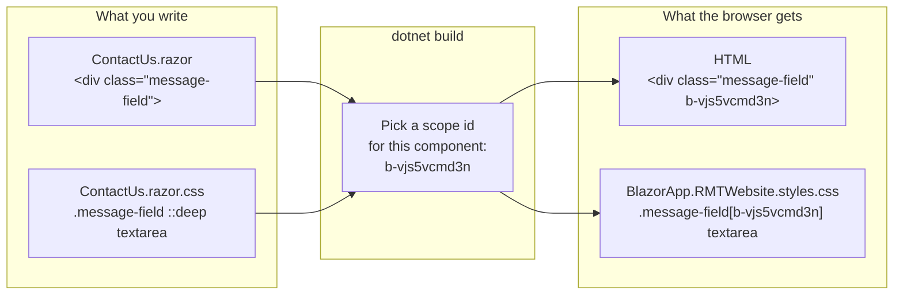
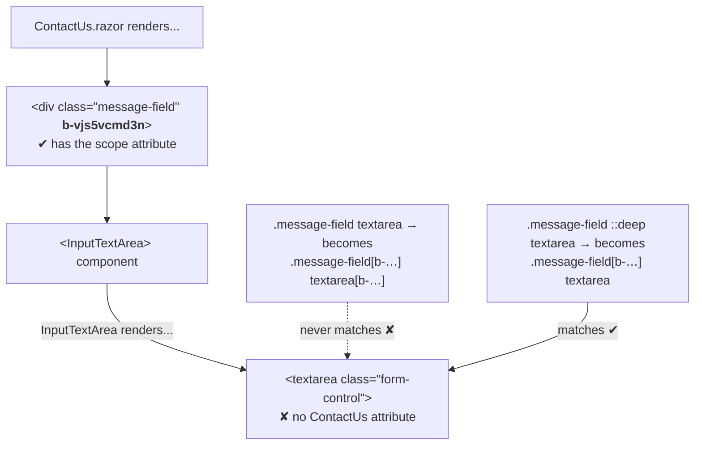

# 2.1 — Inline styles moved to scoped CSS

Plan task 2.1, "Remove inline `style=` attributes". These diagrams show how Blazor's CSS isolation
gets a page's `.razor.css` rules onto its elements, and why the contact form's textarea needs
`::deep`. They render on GitHub and in VS Code's Markdown preview (Mermaid).

## 1. Where each style went

| Before (inline) | After |
|---|---|
| Home frame: `width:100%; height:600px; overflow:hidden` | `.hero` in `Home.razor.css` |
| Home image: `width:100%; height:100%; object-fit:cover` | `.hero-image` in `Home.razor.css` |
| About photo: `height:500px; margin-left:35%` | `.profile-photo` in `About.razor.css` + Bootstrap `d-block mx-auto` |
| Contact textarea: `resize:none` | `.message-field ::deep textarea { resize: vertical }` in `ContactUs.razor.css` |
| Contact button: `border-radius:10px` | Bootstrap `rounded-3` |

## 2. How CSS isolation works at build time

Every rule in `ContactUs.razor.css` is rewritten to require `[b-vjs5vcmd3n]`, and only elements
written in `ContactUs.razor` get that attribute. That's what stops the rules leaking onto other pages.
`App.razor` loads the combined `BlazorApp.RMTWebsite.styles.css` bundle.

## 3. Why the textarea needs `::deep`

Without `::deep`, the scope attribute is added to the **last** part of the selector (`textarea`),
and the `<textarea>` doesn't have it, so the rule silently does nothing. `::deep` moves the attribute
to the part before it (`.message-field`, which this page renders), so the rule reaches into the child
component. The same pattern is in `NavMenu.razor.css` for `<NavLink>`.

**Rule of thumb:** if the element is produced by a component tag (`<InputText>`, `<NavLink>`,
`<InputTextArea>`), style it through a wrapper element with `::deep`. If it's a plain HTML tag in your
`.razor` file (`
`, ``, `<button>`), a normal scoped rule works.

## 4. How the test keeps it this way

`InlineStyleTests` checks every `.razor` file under `Components/` (comments removed) for
`style="` or `style='`. A new inline style anywhere fails `dotnet test` and names the file.
