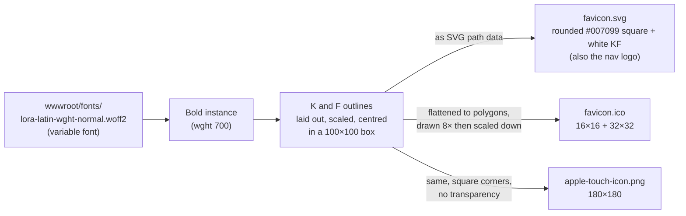
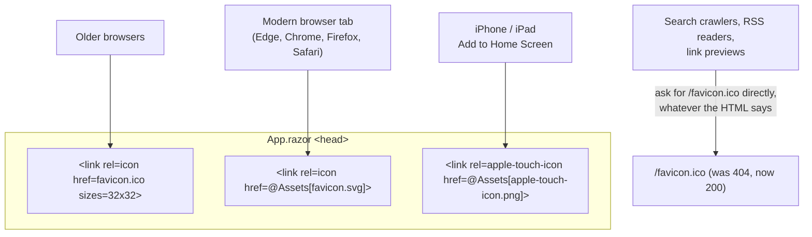
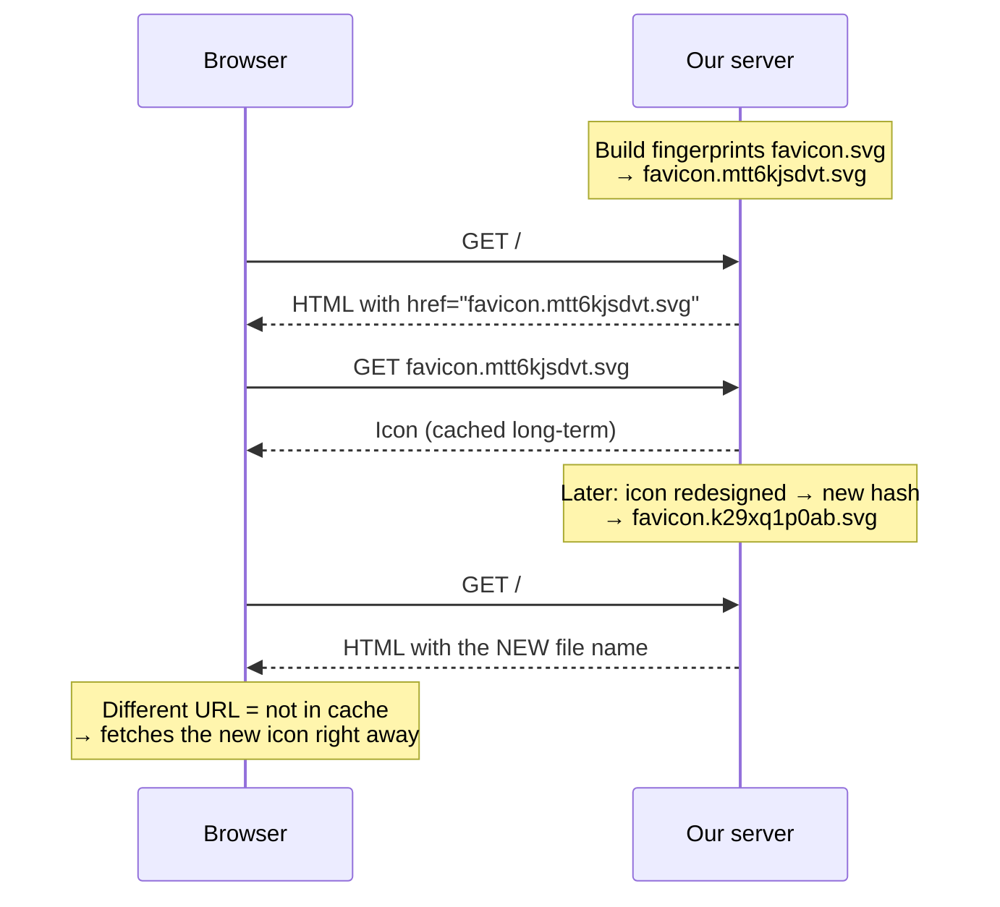
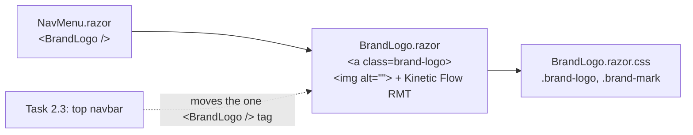

# 2.1 — KF logo and favicon

Plan task 2.1, last step. These diagrams show how the KF monogram is made, which file each client
uses, and how the logo reaches the nav. They render on GitHub and in VS Code's Markdown preview (Mermaid).

## 1. One source, three files

Every icon comes from the same Lora **K** and **F** glyph outlines, so they always match.



**Why the letters are outlines, not text:** an SVG used as an image (`` or a favicon) is
sandboxed, so it can't load the page's web fonts. Text in it would show in a fallback font. Turning
the letters into path outlines means the SVG needs no font at all.

**Why the iPhone icon has square corners:** iOS rounds the corners itself and fills any transparent
pixels with black, so the PNG must be a solid full square.

## 2. Which client uses which file



## 3. Favicon caching and `@Assets`

Browsers cache favicons for a long time. Without help, a new icon might not appear for days.



`favicon.ico` is the one exception. It keeps its plain name, because crawlers request exactly
`/favicon.ico`.

## 4. How the logo reaches the nav



The old `.navbar-brand` rule moved out of `NavMenu.razor.css`. The `<a>` is now rendered by
`BrandLogo`, a child component, so NavMenu's scoped CSS would no longer match it. That's the same
isolation rule as the textarea in the inline-styles change.

`alt=""` marks the monogram as decorative. The link text already says "Kinetic Flow RMT", so a
screen reader announces it once instead of reading the name twice.

## 5. Regenerating the icons

Only needed if the mark, colour, or font changes. The settings are at the top of `tools/make_icons.py`
(`BRAND_PRIMARY`, `WEIGHT`, `GAP`, …).

```bash
python -m venv .venv-icons                     # throwaway, gitignored
.venv-icons/Scripts/python -m pip install fonttools brotli pillow
.venv-icons/Scripts/python tools/make_icons.py BlazorApp.RMTWebsite/wwwroot
dotnet test                                    # IconAssetTests confirms the links still resolve
```

The output is deterministic: running the script again with the same settings produces byte-identical files.
