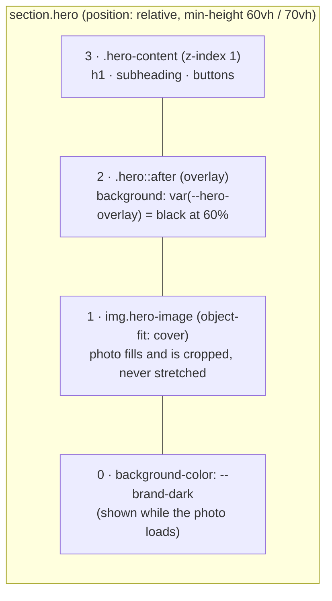
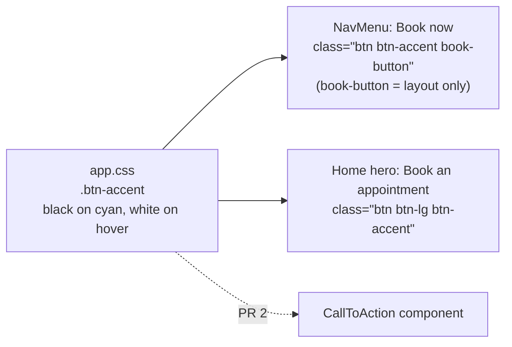

# 2.2 — Home page hero

Plan task 2.2, PR 1. These diagrams show how the hero is layered, why the photo loads first, how
the overlay guarantees readable text, and how the "Book" buttons share one style. They render on
GitHub and in VS Code's Markdown preview (Mermaid). PR 2 (sections below the hero) will add to this file.

## 1. What the first screen answers

| Visitor's question | Answered by | Element |
|---|---|---|
| What is this? | "Therapeutic massage for recovery, pain relief, and performance" | `<h1>` (the page's only one) |
| Where is it? | "Registered massage therapy in Guelph, Ontario" | subheading |
| How do I book? | **Book an appointment** → `/contact` (until 4.1), **View services** → `/services` | two buttons |

Checked in Edge: all three are visible without scrolling at 320, 375, 768, and 1440px.

## 2. How the hero is layered



`min-height` instead of `height`: if the text needs more room (a 320px phone, or 200% zoom), the
hero grows instead of cutting the text off. The negative margins cancel `<main>`'s padding so the
photo runs edge to edge.

## 3. Why an ``, not a CSS background

```mermaid
sequenceDiagram
    participant B as Browser
    participant S as Server

    B->>S: GET /
    S-->>B: HTML
    Note over B: Preload scanner reads the HTML and finds<br/>&lt;img src="images/hero-massage.….jpg" fetchpriority="high"&gt;
    B->>S: GET hero image (high priority, starts immediately)
    B->>S: GET CSS files
    Note over B: With a CSS background-image, the browser<br/>would only learn about the photo HERE,<br/>after downloading and parsing the CSS
    S-->>B: photo + CSS
    Note over B: Largest Contentful Paint = hero photo
```

The hero photo is the biggest thing on the first screen, so it's what Google measures as
**Largest Contentful Paint (LCP)**. Starting its download early makes the page *feel* faster, and LCP
also feeds into search ranking. `width="1920" height="1282"` lets the browser reserve the space
before the photo arrives, so nothing jumps.

## 4. The overlay maths

White text has to reach 4.5:1 contrast over *every* part of the photo, including its brightest pixel.

| Overlay (black) | Pure-white pixel becomes | White text on it |
|---|---|---|
| 0.50 | `#808080` | 3.95:1 ✗ |
| 0.55 | `#737373` | 4.74:1 (just passes) |
| **0.60 (used)** | `#666666` | **5.74:1** ✓ |

Because it holds for a pure-white pixel, it holds for any photo. A future photo swap can't break
contrast as long as `--hero-overlay` stays at 0.6 or above.

## 5. One style for every "Book" button



The colours used to live in `NavMenu.razor.css`, where scoped CSS can't reach other components. Moving
them to a global class means every booking button matches, and a brand colour change happens in one place.

## 6. The photo

- **Source:** Edward Muntinga on Unsplash, https://unsplash.com/photos/CjX9rtKsW8E
- **Licence:** Unsplash License: free for commercial use, no attribution required, but not to be
  sold as-is or used to build a competing photo service.
- **Why this one:** clinical (clothed client, hands-on treatment), and no identifiable therapist, who
  visitors would assume is Nick.
- **Prepared:** 6016×4016 / 3.3 MB → 1920×1282 / 172 KB (JPEG quality 80, progressive), with camera
  metadata stripped.
