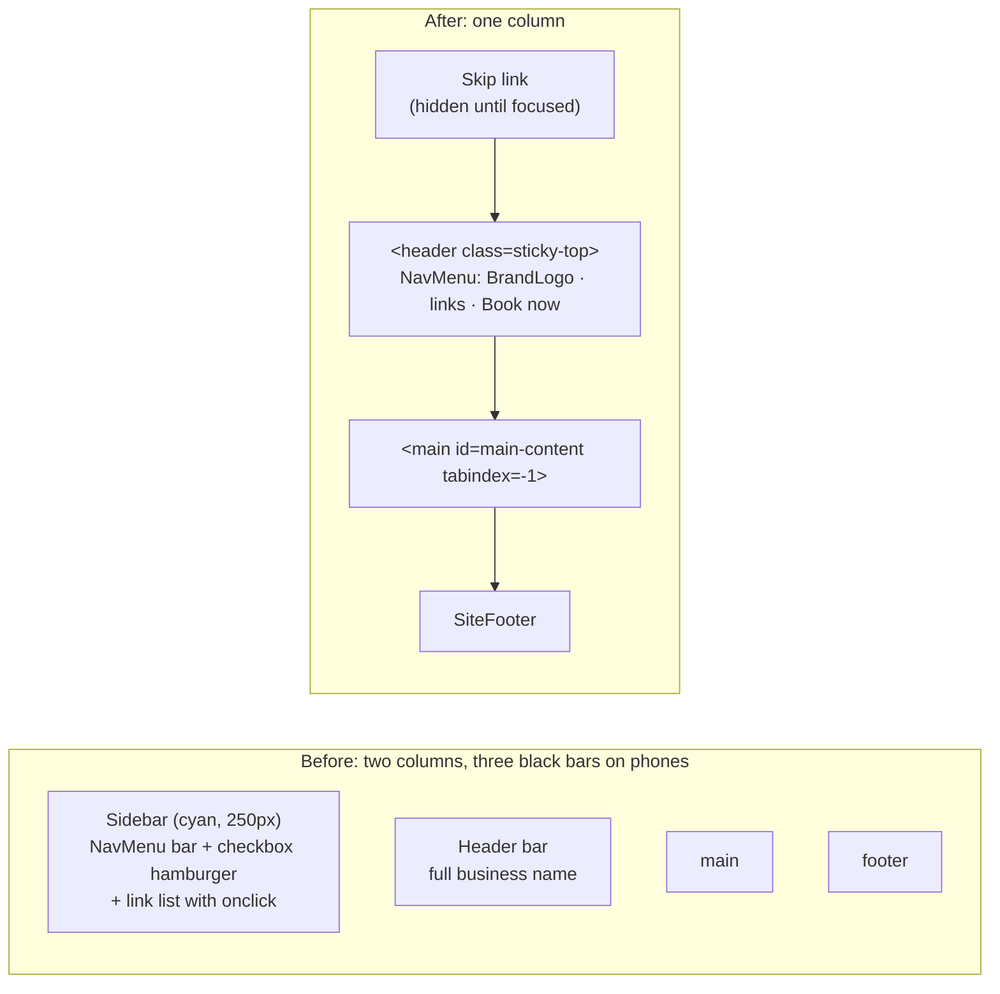
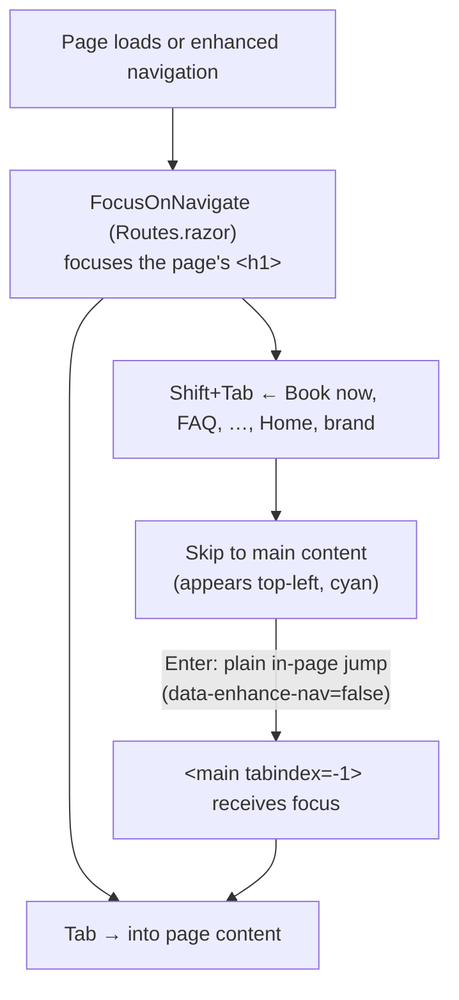

# 2.3 — Top navbar, phone menu, and skip link

Plan task 2.3 (plus 2.4's deferred header merge). These diagrams show the new page skeleton, how
the phone menu opens and closes without any C# running in the browser, and how keyboard focus
moves. They render on GitHub and in VS Code's Markdown preview (Mermaid).

## 1. Page skeleton, before and after



Page content now uses the full width. The full business name still appears in the footer and in
every page's `<title>`. Brand colours come only from `app.css` tokens. The five `rgba()` values from
the old sidebar CSS are gone.

## 2. How the phone menu opens and closes

The site uses static server rendering, so no C# runs in the browser. The menu is plain HTML plus
Bootstrap's JavaScript.

```mermaid
sequenceDiagram
    actor V as Visitor (phone)
    participant BS as Bootstrap collapse JS
    participant DOM as Page DOM
    participant BZ as blazor.web.js (enhanced nav)
    participant S as Server

    V->>DOM: Tap ☰ (button data-bs-toggle="collapse")
    DOM->>BS: click event (listener on document)
    BS->>DOM: #main-nav gets "show", aria-expanded="true"
    V->>DOM: Tap "Services"
    DOM->>BZ: link click intercepted
    BZ->>S: fetch /services
    S-->>BZ: new HTML (nav rendered with class="collapse", aria-expanded="false")
    BZ->>DOM: patch the page to match the new HTML
    Note over DOM: "show" removed and aria-expanded reset,<br/>so the menu closes. No extra script needed.
    BZ->>DOM: FocusOnNavigate focuses the new &lt;h1&gt;
```

**Why the old inline `onclick` isn't needed:** Blazor's enhanced navigation doesn't reload the page.
It *patches* the current DOM to match the server's HTML, and the server always renders the menu
closed. So the patch closes it. Checked in Edge at 375px: after tapping Services, the URL is `/services`,
`#main-nav` has no `show`, and `aria-expanded` is `"false"`.

**Why Bootstrap still works after a patch:** its `data-bs-toggle` listener sits on `document`,
not on the button, so a button that Blazor re-renders is still handled.

## 3. Keyboard focus



**The `<base href="/">` trap:** a skip link written as `href="#main-content"` resolves against the
base URL, so on `/faq` it would go to `/#main-content`, which is the **Home page**. `MainLayout` builds the
href from the current path instead (`faq#main-content`). `data-enhance-nav="false"` makes it a plain
browser jump, which also moves keyboard focus.

**Sticky header and focus:** `html { scroll-padding-top: 5rem }` in `app.css` makes the browser
scroll focused elements and `#anchors` clear of the 60px sticky bar, so it never covers what has focus.

## 4. Link states on the black bar

| State | Look | Contrast |
|---|---|---|
| Normal | White | 21:1 |
| Hover | Cyan `--brand-accent` | 11.06:1 |
| Current page | Cyan **plus a 2px underline**, `aria-current="page"` (added by `NavLink`) | 11.06:1, and not colour-only |
| Keyboard focus | 2px cyan outline (`:focus-visible`) | 11.06:1 |
| Book now | Black on cyan, white on hover | 11.06:1 / 21:1 |

`NavLink` is a component, so its `<a>` doesn't get NavMenu's CSS-isolation attribute. The link
styles reach it with `.site-navbar ::deep .nav-link` (see the inline-styles doc for how `::deep` works).
