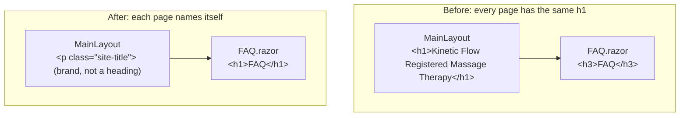
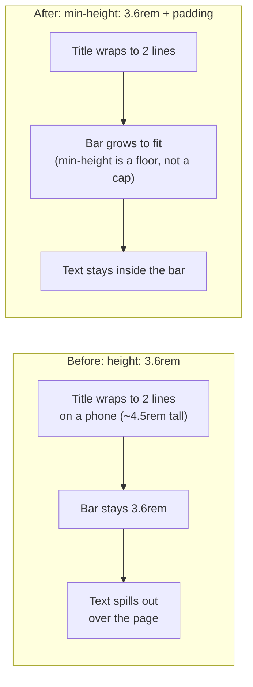
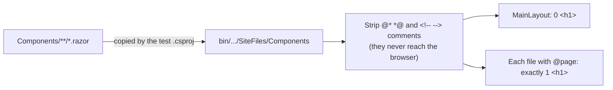

# 2.4 — Responsive header and one `<h1>` per page

Plan task 2.4. These diagrams show how the page outline changed and why the header bar no longer
overflows on phones. They render on GitHub and in VS Code's Markdown preview (Mermaid).

## 1. How a page's headings are built

Every page is rendered inside `MainLayout`. Anything in the layout appears on **every** page, so a
heading there is the same everywhere. That's why the business name moved out of the heading outline.

What a screen reader's heading list shows on the FAQ page:

| Before | After |
|---|---|
| h1 Kinetic Flow Registered Massage Therapy | h1 FAQ |
| h3 FAQ | h5 What is Massage Therapy? *(level skip, fixed in 3.3)* |
| h5 What is Massage Therapy? | … |

On the **Home** page, the `<h1>` is `visually-hidden`. Screen readers announce it, but it takes no
space on screen. Task 2.2 replaces it with a visible hero headline.

## 2. Why the bar overflowed, and how it grows now

The title size uses `clamp(1.25rem, 0.9rem + 1.8vw, 2.25rem)`:

| Screen width | `0.9rem + 1.8vw` | Clamped size | Result |
|---|---|---|---|
| 320px | 14.4 + 5.8 = 20.2px | 20px (min 1.25rem) | 2 lines |
| 375px | 14.4 + 6.75 = 21.2px | 21.2px | 2 lines |
| 1280px | 14.4 + 23 = 37.4px | 36px (max 2.25rem) | 1 line, bar keeps its desktop height |

`vw` is 1% of the screen width, so the middle value grows with the screen, and `clamp()` stops it
from going below the minimum or above the maximum.

## 3. How the tests check this

These tests read the source files, not the rendered HTML. When 6.2 PR 2 adds `WebApplicationFactory`,
they can be swapped for tests that request each page and count `<h1>` tags in the real response.
The overflow itself needs a browser to measure, so it's checked with screenshots for now and can be
automated with Playwright in 6.2 PR 3.
