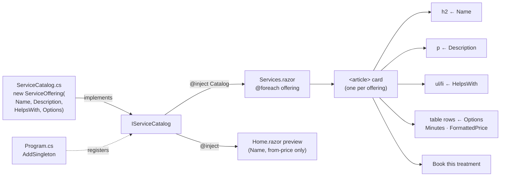
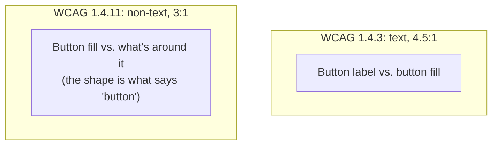
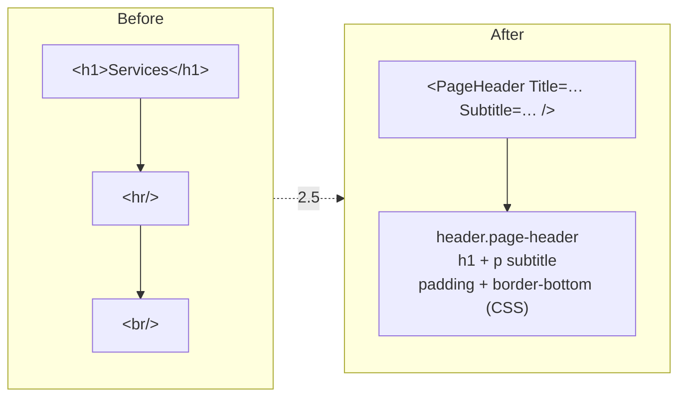

# 2.5 — Services page

Plan task 2.5 (plus step 1 of 2.8, the `PageHeader` component). These diagrams show how one catalog
entry becomes a card, what each part of the card is for, why its button differs from the other "Book"
buttons, and how `PageHeader` replaces the old spacing tags. They render on GitHub and in VS Code's
Markdown preview (Mermaid).

## 1. What the page answers

| Visitor's question | Answered by | Element |
|---|---|---|
| What is this treatment? | 2–3 sentence description | `<p>` in the card |
| Will it help me? | "Helps with" list | `<h3>` + `<ul>` |
| How long, and how much? | Five lengths and prices | `<table>` with a hidden `<caption>` |
| Is there tax, and can I claim it? | "Prices are plus HST. Official receipts are provided…" | pricing note under the cards |
| How do I book? | **Book this treatment** → `/contact` (until 4.1) | `btn-primary` in each card |
| Still unsure? | "Not sure which length?" → **Contact Nick** | `<CallToAction />` band |

## 2. From catalog entry to card



- **One card per treatment, not per length.** The lengths are rows in the card's table. Swedish is the only
  treatment today, so the page shows one card. Adding a treatment to `ServiceCatalog.cs` adds a card with
  no markup changes.
- **Data lives in the model, not the markup.** The description used to have nowhere to live. Now it's a field
  on `ServiceOffering`, so it's tested (`ServiceCatalogTests` pins the approved wording) and ready to
  move into configuration in 4.3.
- **The Home page didn't change.** It reads only `Name` and the prices, so the new fields don't affect it.

## 3. Card anatomy

```
article.service-detail  (aria-labelledby → the h2)
┌───────────────────────────────────┬───────────────────────────────┐
│ .col-md-7                         │ .col-md-5                     │
│                                   │                               │
│ h2#service-0-heading              │ div.table-responsive          │
│   Swedish Massage                 │   table.price-table           │
│ p   description                   │     caption (visually hidden) │
│ h3  Helps with                    │     Length       │ Price      │
│ ul  • Muscle tension …            │     30 minutes   │ $90.00     │
│     • Stress …                    │     …  (th scope="row")       │
│     • …                           │                               │
│                                   │ a.btn.btn-primary → contact   │
│                                   │   Book this treatment         │
└───────────────────────────────────┴───────────────────────────────┘
```

Phones get one column (description, then prices, then button). From 768px (`md`) the description sits on the left
and the prices on the right.

| Piece | What a screen reader gets |
|---|---|
| `aria-labelledby` → h2 | "Swedish Massage, article". Cards can be found by name |
| `<caption>` (visually hidden) | "Swedish Massage prices, table". Sighted users already see the h2 just above it |
| `<th scope="row">` | Each row reads "30 minutes, $90.00", not two loose cells |
| `aria-describedby` on the button | "Book this treatment, Swedish Massage". This keeps identical buttons apart once there are several cards |

The ids come from the card's position (`service-0-heading`, `service-1-heading`, …), so they're always unique on the page.

## 4. Two different contrast rules



| Button | Label on fill (1.4.3) | Fill against a white card (1.4.11) | Fill against a black band (1.4.11) |
|---|---|---|---|
| `.btn-accent` (black on cyan) | 11.06:1 ✓ | **≈1.9:1 ✗** | 11:1 ✓ |
| `.btn-primary` (white on brand blue) | 5.56:1 ✓ | **5.56:1 ✓** | — |

That's why the rule is: **cyan accent on dark backgrounds** (navbar, hero, CallToAction), **brand blue on white**
(the Services card). Every "Book" button still uses a shared global class, just the right one for its background.

Measured in Edge: subtitle, description, and pricing note 15.43:1. Table text 21:1. Book button label 5.56:1.
On hover it darkens to `--brand-primary-hover`, which only raises the contrast.

## 5. PageHeader replaces spacing tags



- `<hr>` means "change of topic" and `<br>` means "line break inside text". Neither is a spacing tool, and
  screen readers announce `<hr>` as a separator. Spacing belongs in CSS.
- `PageHeader` renders the page's single `<h1>`. `HeadingStructureTests` counts `<PageHeader>` as that
  h1, because the source-file test can't see inside the component.
- It's placed **inside** `.container`, so the heading's left edge lines up with the cards at every width.
- It doesn't set `<PageTitle>`. Each page still chooses its own browser-tab title.
- Used only on Services for now. Rolling it out to About, Contact, FAQ, and Not Found is the rest of 2.8.

## 6. Full-bleed bands are now site-wide

`.full-bleed` (negative margins that cancel `<main>`'s side padding) moved from `Home.razor.css` to
`app.css`. Scoped CSS applies only to its own component, so once a second page needed it (the Services
call to action), it had to become global. The rule of thumb: **keep styles scoped until a second component needs them.**

## 7. How it was checked

| Check | Result |
|---|---|
| `ServicesPageTests` (6 tests, rendered HTML) | h1 + subtitle, card per offering, price table matches catalog, Book button, pricing note, CTA last |
| `ServiceCatalogTests` | every offering has a description and "helps with" list; approved copy pinned |
| `ServicesMarkupTests` | no `<hr>` or `<br>` in `Services.razor` |
| Edge at 320 / 375 / 768 / 1440px and 200% zoom | no horizontal scroll; stacked below 768px, two columns from 768px |
| Keyboard | Book button: white + brand-blue focus ring. Contact Nick: 2px cyan outline |
