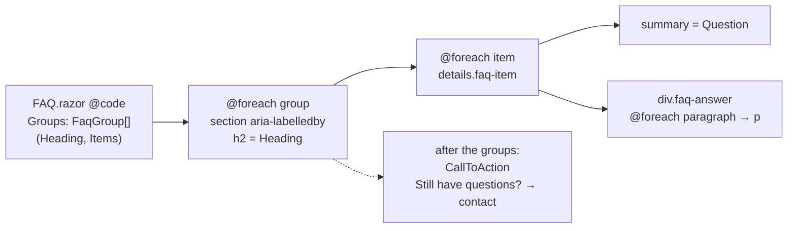
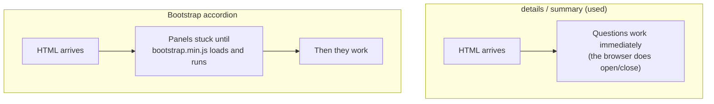

# 2.7 — FAQ accordion

Plan task 2.7. This page explains how the FAQ data becomes collapsible questions, why it uses the browser's own
`<details>`/`<summary>` instead of a JavaScript accordion, what screen readers get, and how the content is protected
by tests. The diagrams render on GitHub and in VS Code's Markdown preview (Mermaid).

## 1. Before and after

| | Before | After |
|---|---|---|
| Questions | 3 | 9, in 3 groups |
| Structure | `<p><h5>question</h5> answer…</p>` (invalid: a heading can't sit inside a paragraph) | `<section>` → `<h2>` → `<details>` → `<summary>` + paragraphs |
| Headings | h1 → h5 (skips three levels) | h1 → h2 |
| Line breaks | 9 `<br />` that chop sentences mid-line on phones | none: answers are paragraphs that reflow |
| Separators | 2 `<hr />` | CSS borders on each question |
| Collapsible | no | yes, all closed by default |
| End of page | nothing | "Still have questions?" → Contact |

## 2. From data to page



```csharp
private sealed record FaqGroup(string Heading, IReadOnlyList<FaqItem> Items);
private sealed record FaqItem(string Question, IReadOnlyList<string> Answer);   // Answer = paragraphs
```

- **To add a question, add one line of data.** The markup loops; there's no copy-pasted block to get wrong.
- **An answer is a list of paragraphs**, so there's nowhere to put a `<br>`. That makes the old line-break problem impossible.
- **The data lives in the page.** Only the FAQ uses it, so a service and interface (like `IServiceCatalog`, which two pages
  share) would be extra code with no benefit yet. **4.3** moves editable content into configuration, and this list is
  ready for that: it's already data, not markup.

## 3. Why `<details>`/`<summary>`, not Bootstrap's accordion



| Need | `<details>` gives it by | Bootstrap needs |
|---|---|---|
| Open/close | the browser | JavaScript |
| Keyboard (Tab, Enter, Space) | the browser | JavaScript + `<button>` |
| "Collapsed/expanded" for screen readers | the browser | `aria-expanded` kept in sync by JS |
| Unique ids | not needed | `id` + `aria-controls` per question |
| Find in page (Ctrl+F) | Chrome/Edge open the matching answer | text in closed panels isn't found |

The site uses **static server rendering**: the server sends finished HTML, with no live connection. A feature that
works in plain HTML is the most robust choice for that model.

## 4. What screen readers get

Read from Edge's accessibility tree (what assistive technology actually receives):

```
main
├─ heading "Frequently asked questions"  level 1
├─ region "About massage therapy"
│  ├─ heading "About massage therapy"  level 2
│  ├─ DisclosureTriangle "What is massage therapy?"   expanded: false  ← announced as a button
│  ├─ …
├─ region "Your first visit"
└─ region "Billing and policies"
```

- **The regions come from `<section aria-labelledby>`.** Users can jump between groups by landmark or by heading.
- **The question is plain text in `<summary>`, not a heading.** A heading inside `<summary>` can make some screen readers
  stop announcing it as a button. The group h2s give the page its outline instead.
- **The + / − marker is decorative.** It's written as `content: "+" / ""`. The part after `/` is the alt text, which is
  empty, so screen readers don't say "plus". The accessible name is exactly the question; the open state is already announced.

## 5. Styling the native element

| Rule | Why |
|---|---|
| `list-style: none` + `::-webkit-details-marker { display: none }` | hides the browser's triangle (the second rule is for Safari) |
| `summary::after` with `+`, and `[open] summary::after` with `−` | the open/closed state in brand blue (5.56:1) |
| `padding-right: 2.5rem` on summary | long questions wrap before reaching the marker (checked: no overlap at 320px) |
| `outline-offset: 2px` on `:focus-visible` | the focus ring sits outside the row. An inset ring touched the first letter (found in the browser check) |
| whole row clickable | a large touch target, well above the 24×24px minimum (WCAG 2.5.8) |

## 6. Content as promises

Every answer is pinned word for word in `FaqPageTests.Get_Faq_AnswerMatchesApprovedCopy` (9 cases). Some are
commitments to clients, and all of them are health-advertising copy:

| Question | Fact behind it (confirmed 2026-10-06) |
|---|---|
| Do you bill my insurance directly? | No direct billing. Official receipts for reimbursement (matches the Services note) |
| What payment methods do you accept? | Debit, credit card, Interac e-Transfer; prices plus HST |
| What is your cancellation policy? | 24 hours' notice; late cancellations and no-shows may be charged the full fee |
| What should I wear? · Do I need a referral? · How often should I book? | Approved copy |
| What is massage therapy? · Benefits · First visit | Existing answers, edited and approved after review. Assessment wording avoids implying a diagnosis (a controlled act RMTs can't perform in Ontario), and the vague claims were removed |

Changing one of these means changing a test, which makes the change deliberate and visible in review.
**Parking and accessibility** is not answered yet. It comes with the location details in **3.2**.

## 7. How it's tested

| Test | Checks |
|---|---|
| `Get_Faq_HasAtLeastEightQuestions` | ≥ 8 questions, each with text and answer paragraphs that all contain text (roadmap "Done when"). An empty `<p>` fails |
| `Get_Faq_QuestionsAreCollapsedByDefault` | no `<details open>`. It checks the list isn't empty and that every `<details>` on the page was parsed |
| `Get_Faq_ShowsAgreedQuestionsInOrder` | the 9 agreed questions, in order |
| `Get_Faq_GroupsAreSectionsWithH2Headings` | 3 named sections × 3 questions, h2 matched through `aria-labelledby`, no h3–h6 |
| `Get_Faq_AnswerMatchesApprovedCopy` (9 cases) | every answer, word for word (compared paragraph by paragraph) |
| `Get_Faq_AnswersHaveNoLineBreaks` | no `<br>` in any answer |
| `Get_Faq_EndsWithContactCallToAction` | "Still have questions?" after the last question; **Contact Nick** → Contact |
| `PageMarkupTests` (FAQ row) | no `<hr>`/`<br>` in `FAQ.razor`'s source |

**Browser (Edge):**
- no horizontal scroll at 320, 375, 768 and 1440px or at 200% zoom, with everything closed and everything open
- keyboard open and close
- focus ring
- the accessibility tree above
- contrast

**Ctrl+F auto-open is not verified by automation.** Scripts can't open the browser's find box. Check it by hand.
