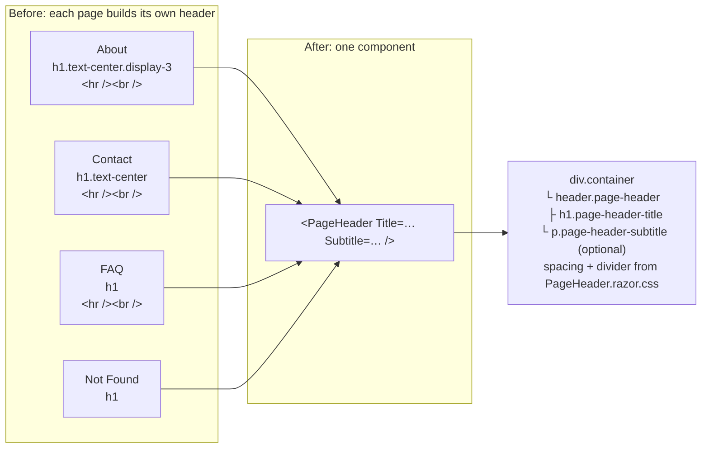

# 2.8 — Shared page header

Plan task 2.8. `PageHeader` was built in 2.5 and used only on Services. This task rolls it out to every content
page, so they all start the same way. The diagrams render on GitHub and in VS Code's Markdown preview (Mermaid).

## 1. Before and after



| Page | h1 | Subtitle |
|---|---|---|
| Services | Services and rates | Registered massage therapy in Guelph, Ontario |
| About | Nicholas Turco, RMT | Registered massage therapist in Guelph, Ontario |
| Contact | Contact us | Questions or appointment requests? Send a message below. |
| FAQ | Frequently asked questions | (none) |
| Not Found | Page not found | (none) |

Home is the exception: its hero is its header. Error is rewritten in 3.5.

## 2. Why the component owns its `.container`

```
<main>  (px-3 / px-lg-4)
┌──────────────────────────────────────────────────────────────┐
│   div.container  ← PageHeader                                │
│   │ Services and rates                                       │
│   │ ─────────────────────────────────────────────            │
│   div.container  ← the page's content                        │
│   │ card, form, answers…                                     │
│   ↑                                                          │
│   same left edge at every width, because both are .container │
└──────────────────────────────────────────────────────────────┘
```

- In 2.5, Services put `PageHeader` *inside* its own container. That works, but every new page would have to remember
  the wrapper, and one that forgot would be misaligned. Putting the container inside the component means **the right
  layout is the default**.
- The trade-off is that pages must put `<PageHeader>` *outside* their own container. A container inside a container
  adds side padding twice. The component's comment says so.
- Measured in Edge, the heading's left edge and the content's left edge match on all five pages at 320, 375, 768,
  and 1440px (28, 28, 36, and 72px).

### Two layout fixes this exposed

| Page | Problem once the header was aligned | Fix |
|---|---|---|
| FAQ, Not Found | Body text wasn't in any `.container`, so it started further left than the heading | Wrapped in `.container` (layout only) |
| About | The bio was in a bare `<div>`. It only *looked* aligned because it's centred, and the first browser check measured the photo's container, not the bio (caught in review) | Wrapped in `.container` (layout only; follow-up PR) |
| Contact | `container w-75` made the form 75% wide and centred, so it never lined up | Dropped `w-75`. The inputs also get more room on phones |

## 3. What's left for later tasks

| Remaining issue | Seen at | Fixed in |
|---|---|---|
| `<br>`s inside the About bio | About | **2.6** (bio rebuilt as short paragraphs) |
| `<br>`s inside answers, `<hr>` between questions, `<h5>` inside `<p>` | FAQ (on phones the forced breaks chop sentences mid-line) | **2.7** (accordion) |
| `w-25` inputs too narrow on phones; stale validation text while "Sending…"; the status message is a `<label>` with no `aria-live`, so screen readers don't announce "sent"/"failed" | Contact | **3.1** |
| No `<PageTitle>` and no helpful links | Not Found | **3.5** |

`PageMarkupTests.PageRazor_Markup_HasNoHrOrBrTags` covers Services, Contact, and Not Found now. About and FAQ join it
when 2.6 and 2.7 remove their last `<br>`s. That's when the roadmap's "no `<hr /><br />` spacing hacks remain" is fully met.

## 4. How it's tested

| Test | Checks, for each of the five pages |
|---|---|
| `PageHeaderTests.Get_ContentPage_RendersSinglePageHeaderH1` | Exactly one `<h1>`, inside `header.page-header`, with the agreed wording and subtitle (or none) |
| `PageHeaderTests.Get_ContentPage_PageHeaderContainerIsFirstInMain` | PageHeader's `.container` is the first thing in `<main>`, so a page that wraps it in a second container fails |
| `PageHeaderTests.Get_ContentPage_ContentAfterHeaderIsInContainer` | The page content right after the header starts in a `.container` |
| `PageHeaderTests.Get_ContentPage_NoHrOrBrAfterHeader` | The first element after the header isn't `<hr>` or `<br>` |
| `PageMarkupTests.PageRazor_Markup_HasNoHrOrBrTags` | Source has no `<hr>`/`<br>` (Services, Contact, Not Found) |
| `HeadingStructureTests` (existing) | Still one h1 per routable page, counting `<PageHeader>` |

The Not Found case requests `/no-such-page`. The test reads the body of the 404 response, because the friendly page is
still returned with a 404 status for search engines.
