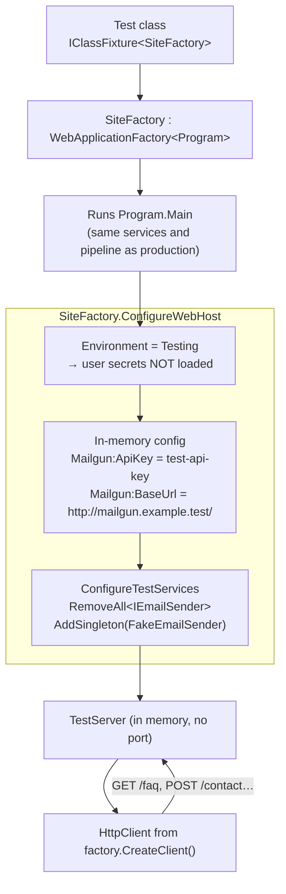

# 6.2 PR 2 — Integration tests with WebApplicationFactory

These diagrams show how the integration tests run the whole site in memory, how they keep away from
Mailgun, and how a contact-form test submits the form like a browser. They render on GitHub and in
VS Code's Markdown preview (Mermaid). Unit tests (PR 1) are in `6.2-unit-testing.md`.

## 1. Three kinds of test, and what each can see

| Kind | Example | Sees | Speed |
|---|---|---|---|
| Unit | `EmailSenderServiceTests` | One class, with fakes around it | Fastest |
| Source-file | `HeadingStructureTests`, `NavMenuTests` | The `.razor` text, not the rendered page | Fast |
| **Integration (new)** | `PageRoutingTests`, `ContactFormTests` | The **real HTML** the site sends, through the full `Program.cs` pipeline | ~1s to start, then fast |
| Browser (PR 3, later) | Playwright | What a person sees: layout, JavaScript, focus | Slowest |

## 2. How SiteFactory starts the site



**Why three layers of protection?** User secrets hold the live Mailgun key and are only loaded in
the `Development` environment. Running as `Testing` keeps them out entirely. The fake config means
that even if the real sender ran, it would call an address that can never resolve (`.test` is a
reserved domain). The fake sender means it doesn't run at all.

**Proof that the fake is wired in:** with the `RemoveAll`/`AddSingleton` lines commented out,
`Post_ValidForm_SendsOneEmailAndShowsSuccess` fails, because the real sender can't reach the fake
address. With them back in, all tests pass.

## 3. Submitting the contact form like a browser

```mermaid
sequenceDiagram
    participant T as ContactFormTests
    participant C as HttpClient (keeps cookies)
    participant S as Site (in memory)
    participant F as FakeEmailSender

    T->>C: GET /contact
    C->>S: request
    S-->>C: HTML with hidden __RequestVerificationToken and _handler<br/>+ antiforgery cookie
    T->>T: read the hidden fields, add Inquiry.EmailAddress / Subject / Content
    T->>C: POST /contact (form fields)
    C->>S: request + antiforgery cookie
    S->>S: antiforgery check → model binding → DataAnnotations validation
    alt valid
        S->>F: SendEmailAsync(email, subject, message)
        F-->>S: recorded (or throws if ShouldFail)
    else invalid
        S-->>S: no send; validation messages rendered
    end
    S-->>C: page HTML with the result message
    T->>F: Assert.Single(SentEmails)…
    T->>T: Assert HTML contains "Message successfully sent." / error text
```

**Antiforgery** stops other websites from submitting the form on a visitor's behalf. The server puts
a secret token in the page *and* in a cookie, and only accepts a POST that sends both back. The
test passes it exactly the way a browser does, so the real protection stays switched on during tests.

## 4. What the new tests cover

| Test | Checks |
|---|---|
| `Get_KnownRoute_ReturnsOkWithPageTitle` ×5 | `/`, `/services`, `/about`, `/contact`, `/faq` return 200 with the right `<title>` |
| `Get_UnknownRoute_ReturnsNotFoundPage` | 404 status **and** the friendly Not Found text |
| `Post_ValidForm_SendsOneEmailAndShowsSuccess` | Exactly one email, with the visitor's address, subject, and message, plus the success text |
| `Post_MissingEmailAddress_ShowsValidationMessageAndSendsNothing` | Server-side validation blocks the send |
| `Post_SenderThrows_ShowsFailureMessage` | A Mailgun failure shows the error, not a false "sent" |

The Home page PRs (2.2) add rendered-HTML checks here, e.g. "the hero has a visible `<h1>` and links
to `contact` and `services`".
