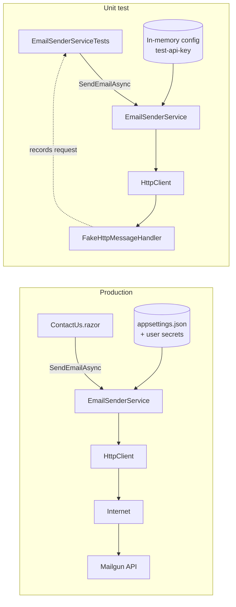
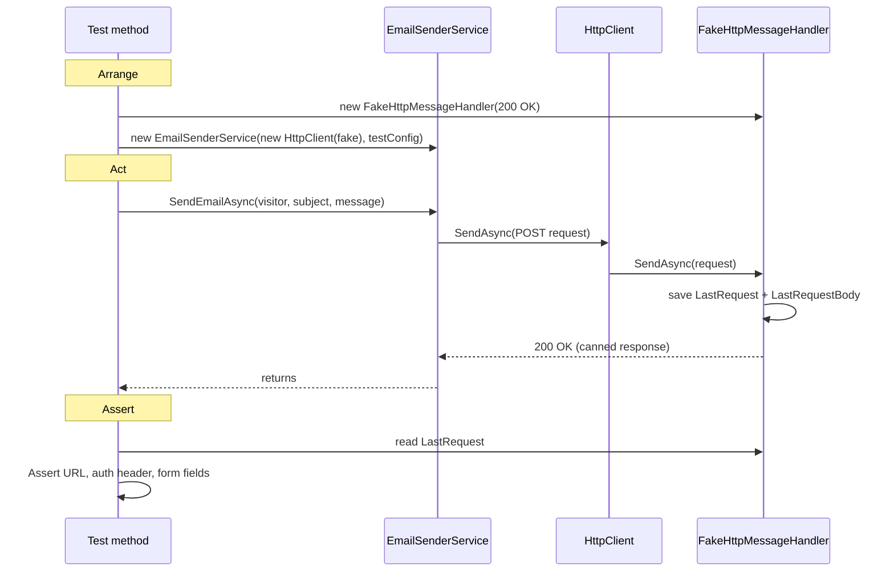

# 6.2 — How the unit tests work

Plan task 6.2, PR 1. These diagrams show how a unit test runs `EmailSenderService` without
touching Mailgun. They render on GitHub and in VS Code's Markdown preview (Mermaid).

## 1. In production vs. in a test

In the real site, `Program.cs` registers the service with a real `HttpClient`, and settings come
from `appsettings.json` plus user secrets. In a test, we build the service ourselves and hand it
two stand-ins:



The service code is **identical** in both. Only its inputs change. That's why the constructor
takes `HttpClient` and `IConfiguration` as parameters (dependency injection): it makes the
class testable.

## 2. One test, step by step (Arrange / Act / Assert)



## 3. What each test proves

| Test | Proves |
|---|---|
| `SendEmailAsync_ValidConfig_PostsToMailgunBaseUrl` | Sends a POST to the configured URL |
| `SendEmailAsync_ValidConfig_UsesBasicAuthWithApiKey` | Auth header is `Basic base64("api:<key>")` |
| `SendEmailAsync_ValidConfig_SendsRecipientSubjectAndMessage` | Form fields `to`, `subject`, `text` are filled |
| `SendEmailAsync_MissingRequiredSetting_ThrowsWithoutSending` | Missing key or URL fails fast and sends nothing |
| `SendEmailAsync_MailgunReturnsError_Throws` | Mailgun errors reach the contact page |
| `EmailInquiryTests` | The form's validation rules (required, email format, length limits) |

## 4. How to run

```bash
dotnet test                                              # everything
dotnet test --filter-method "*EmailSenderService*"       # just one class's tests
```

In Visual Studio: **Test → Test Explorer → Run All**.
